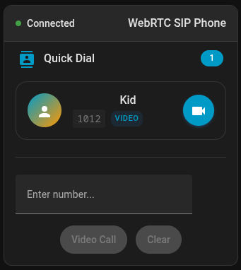
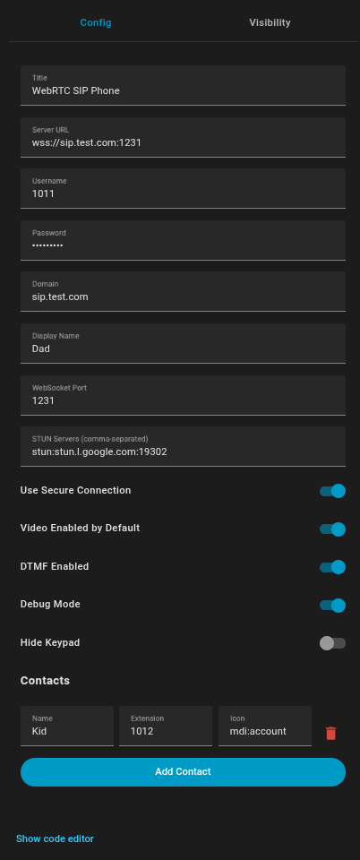

# WebRTC SIP Card for Home Assistant

[![GitHub Release][releases-shield]][releases]
[![GitHub Activity][commits-shield]][commits]
[![License][license-shield]](LICENSE)
[![hacs][hacsbadge]][hacs]

![Project Maintenance][maintenance-shield]
[![BuyMeCoffee][buymecoffeebadge]][buymecoffee]

[![Community Forum][forum-shield]][forum]

A modern WebRTC SIP client card for Home Assistant that enables video calling functionality with proper media stream handling, call state management, and UI controls.

## Features

- 📞 **SIP Calling**: Connect to SIP servers and make/receive calls directly from Home Assistant
- 🎥 **Video Calls**: Full video calling support with camera on/off controls
- 👥 **Contact Management**: Configure contacts with names, extensions, and icons
- 🎧 **Audio Calls**: Pure audio calls without video
- 📱 **Responsive Design**: Works perfectly on mobile and desktop
- 🎛️ **Call Controls**: Answer, reject, hangup, mute controls
- 📲 **DTMF Support**: Send DTMF tones during calls
- 🔢 **Keypad**: Dial pad for calling specific extensions
- 🕐 **Call Timer**: Automatic call duration tracking
- 🔄 **Auto Reconnection**: Automatic reconnect on connection failures
- 🔧 **TypeScript**: Built with modern development practices

## Installation

### HACS (Recommended)

1. Open HACS in your Home Assistant instance
2. Click on "Frontend" in the bottom bar
3. Click on the 3-dots menu in the top right
4. Select "Custom repositories"
  5. Add this repository URL: `https://github.com/Ahmed9190/ha-webrtc-sip-card`
6. Select "Lovelace" as category
7. Click "Install"
8. Restart Home Assistant

### Manual Installation

1. Download the latest `ha-webrtc-sip-card.js` from the [releases page][releases]
2. Place the file in your `config/www/` folder
3. Add the resource to your dashboard:
   - Go to Settings → Dashboards
   - Click the three dots menu, then "Resources"
   - Click "Add Resource"
   - URL: `/local/ha-webrtc-sip-card.js`
   - Resource type: `JavaScript Module`

## Configuration

### Visual Editor
The easiest way to configure this card is through the visual editor in the Home Assistant dashboard UI.

### Manual Configuration

| Option | Type | Default | Description |
|--------|------|---------|-------------|
| `type` | string | **Required** | `custom:ha-webrtc-sip-card` |
| `title` | string | `"WebRTC SIP Phone"` | Card title |
| `server_url` | string | **Required** | SIP server WebSocket URL (e.g., `wss://your-sip-server.com:8089/ws`) |
| `username` | string | **Required** | SIP account username |
| `password` | string | **Required** | SIP account password |
| `domain` | string | Optional | SIP domain (defaults to server hostname) |
| `display_name` | string | Optional | Display name for outgoing calls |
| `websocket_port` | number | `443` | WebSocket port (80 for ws, 443 for wss) |
| `use_secure` | boolean | `false` | Use secure WebSocket connection |
| `debug` | boolean | `false` | Enable debug logging |
| `hide_keypad` | boolean | `false` | Hide the DTMF keypad |
| `contacts` | array | `[]` | Array of contact objects |

### Contact Configuration

| Option | Type | Default | Description |
|--------|------|---------|-------------|
| `name` | string | **Required** | Contact display name |
| `extension` | string | **Required** | Contact extension to dial |
| `icon` | string | `"mdi:account"` | Contact icon (Material Design icon) |

### Example Configuration

```
type: custom:ha-webrtc-sip-card
title: Office Phone
server_url: wss://sip.example.com:8089/ws
username: homeassistant
password: yourpassword
domain: sip.example.com
display_name: Home Assistant Phone
websocket_port: 8089
use_secure: true
contacts:
  - name: Front Door
    extension: "1001"
    icon: mdi:door
  - name: Kitchen
    extension: "1002"
    icon: mdi:silverware
  - name: Office
    extension: "1003"
    icon: mdi:desk
debug: false
hide_keypad: false
```

## Screenshots




## Troubleshooting

### Common Issues

1. **WebSocket Connection Failed**
   - Verify server URL and port are correct
   - Check that the SIP server is running and accessible
   - Ensure firewall allows WebSocket connections

2. **Camera/Microphone Permissions**
   - Check browser permissions for camera and microphone
   - Ensure you're using HTTPS for production (required for WebRTC)

3. **Call Quality Issues**
   - Check STUN/TURN server configuration
   - Verify network connectivity and bandwidth

### Debug Mode

Enable debug mode in the card configuration to see detailed logs in your browser's console for troubleshooting.

## Development

This card is built with:
- [Lit](https://lit.dev/) - Modern web components
- [TypeScript](https://www.typescriptlang.org/) - Type safety
- [Vite](https://vitejs.dev/) - Build and development tools
- [SIP.js](https://sipjs.com/) - WebRTC SIP client library

### Development Setup

```
    git clone https://github.com/Ahmed9190/ha-webrtc-sip-card
cd ha-webrtc-sip-card
npm install
npm run dev
```

### Available Scripts

- `npm run build` - Build for production
- `npm run dev` - Development build with watch
- `npm run preview` - Preview build
- `npm run lint` - Run ESLint
- `npm run type-check` - TypeScript type checking

## Contributing

Contributions are welcome! Please read our [Contributing Guidelines](.github/CONTRIBUTING.md) first.

1. Fork this repository
2. Create a feature branch: `git checkout -b feature/amazing-feature`
3. Commit your changes: `git commit -m 'Add amazing feature'`
4. Push to the branch: `git push origin feature/amazing-feature`
5. Open a Pull Request

## Support

- 🐛 [Report bugs](https://github.com/Ahmed9190/ha-webrtc-sip-card/issues)
- 💡 [Request features](https://github.com/Ahmed9190/ha-webrtc-sip-card/issues)
- 💬 [Join discussions](https://github.com/Ahmed9190/ha-webrtc-sip-card/discussions)
- ☕ [Buy me a coffee][buymecoffee]

## Changelog

See [CHANGELOG.md](CHANGELOG.md) for details of each release.

## License

This project is licensed under the MIT License - see the [LICENSE](LICENSE) file for details.

## Requirements

- Home Assistant 2023.4.0 or later
- A SIP server that supports WebSocket connections (like Asterisk, FreeSWITCH, etc.)
- Browser that supports WebRTC and MediaStream API (Chrome, Firefox, Edge, Safari 15+)
- HTTPS for production environments (required for WebRTC functionality)

---

[releases-shield]: https://img.shields.io/github/release/Ahmed9190/ha-webrtc-sip-card.svg?style=for-the-badge
[commits-shield]: https://img.shields.io/github/commit-activity/y/Ahmed9190/ha-webrtc-sip-card.svg?style=for-the-badge
[license-shield]: https://img.shields.io/github/license/Ahmed9190/ha-webrtc-sip-card.svg?style=for-the-badge
[releases]: https://github.com/Ahmed9190/ha-webrtc-sip-card/releases
[commits]: https://github.com/Ahmed9190/ha-webrtc-sip-card/commits/main
[hacs]: https://github.com/hacs/default
[hacsbadge]: https://img.shields.io/badge/HACS-Default-orange.svg?style=for-the-badge
[forum-shield]: https://img.shields.io/badge/community-forum-brightgreen.svg?style=for-the-badge
[forum]: https://community.home-assistant.io/
[buymecoffee]: https://www.buymeacoffee.com/aw919
[buymecoffeebadge]: https://img.shields.io/badge/buy%20me%20a%20coffee-donate-yellow.svg?style=for-the-badge
[maintenance-shield]: https://img.shields.io/badge/maintainer-%40Ahmed9190-blue.svg?style=for-the-badge